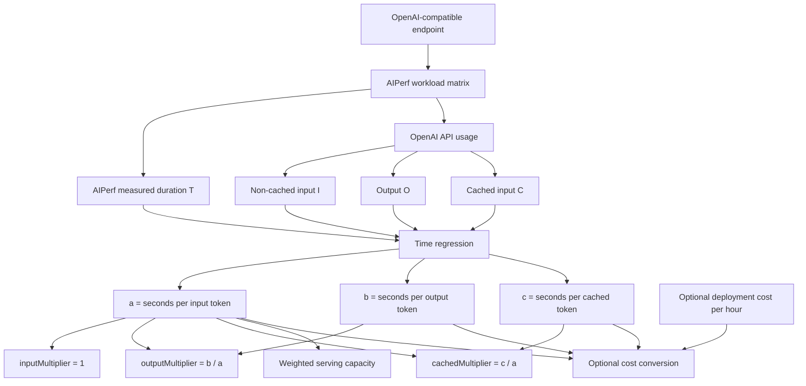
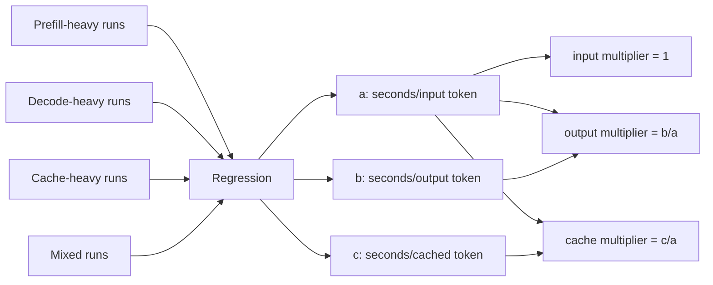
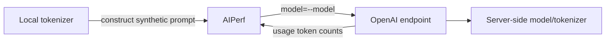
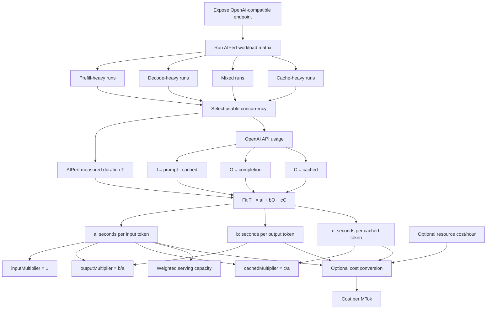

# perf2price - AIPerf OpenAI Cost Benchmark

A reusable, backend-independent benchmark harness for LLMs exposed through an **OpenAI-compatible Chat Completions API**.

The goal is to measure the performance of a served model and derive an empirical token-cost model that can be used for internal accounting or chargeback. The same harness can be used whether the model is served by:

- NVIDIA Dynamo on Kubernetes
- vLLM
- SGLang
- TensorRT-LLM
- another OpenAI-compatible inference server
- a local workstation or laptop
- a remote GPU cluster

The benchmark talks only to the OpenAI-compatible API. It therefore does not need to know which backend or orchestration system is behind the endpoint.

The harness estimates relative cost multipliers for:

- non-cached input tokens
- output tokens
- cached input tokens, when the server reports them

If you also provide the hourly cost of the complete serving allocation, the harness converts the measured performance into **cost-recovery prices per million tokens, expressed in the same cost unit you supplied**.

> **Important:** `resource_hour_cost` is not measured by AIPerf. It is supplied by you. The token prices and multipliers are derived from benchmark measurements.

---

## Contents

```text
perf2price/
├── README.md
├── requirements.txt
├── perf2price.sh
└── examples/
    └── benchmark-plan.csv
```

---

# 1. What the benchmark measures

The benchmark starts from quantities that are directly measured during an AIPerf run.

For each selected benchmark run, the harness records:

- `T` = benchmark duration reported by AIPerf, in seconds
- `I` = non-cached input tokens reported by the OpenAI-compatible API
- `O` = output tokens reported by the OpenAI-compatible API
- `C` = cached input tokens reported by the OpenAI-compatible API, when available

The key point is that **time is the primary resource quantity**.

The benchmark does **not** need a monetary cost to determine the relative cost of input, output, and cached tokens.

The first model that the harness tries to fit is:

$$
T_j \approx a I_j + b O_j + c C_j
$$

for benchmark run `j`.

The coefficients have a direct interpretation:

- `a` = seconds of serving capacity per non-cached input token
- `b` = seconds of serving capacity per output token
- `c` = seconds of serving capacity per cached input token

Once the coefficients are known, the normalized token multipliers are:

$$
inputMultiplier = 1
$$

$$
outputMultiplier = \frac{b}{a}
$$

$$
cachedMultiplier = \frac{c}{a}
$$

The equivalent weighted-token model is:

$$
W = I + \frac{b}{a}O + \frac{c}{a}C
$$

These multipliers are independent of currency. They describe the relative amount of serving capacity consumed by each token type for the measured deployment.

---

# 2. The time-first algorithm

The benchmark has two stages:

1. **Measure serving efficiency and derive token coefficients from time.**
2. **Optionally convert those coefficients into a cost model if an hourly deployment cost is supplied.**

The first stage is always available and is the important one.



## Step 1 — Run deliberately different workloads

A single workload cannot separate the contribution of input, output, and cached tokens.

The harness therefore runs profiles that emphasize different parts of inference:

| Profile type | Example | Purpose |
|---|---:|---|
| Prefill-heavy | 16K input / 64 output | Make input/prefill work dominate |
| Decode-heavy | 512 input / 2K output | Make output/decode work dominate |
| Mixed | 8K input / 1K output | Measure realistic mixed behavior |
| Cache-heavy | shared 8K prefix + unique input | Observe cached-token behavior |

Each profile is also tested at several concurrency levels.

The default concurrency sweep is:

```text
4,8,16,32,64
```

The important result for coefficient fitting is not the requested ISL or OSL alone. It is the **actual token usage reported by the server** together with the **actual benchmark duration reported by AIPerf**.

---

## Step 2 — Read actual token counts from the OpenAI-compatible API

The benchmark uses AIPerf with:

```bash
--use-server-token-count
```

A typical response may contain:

```json
{
  "usage": {
    "prompt_tokens": 8217,
    "completion_tokens": 1019,
    "prompt_tokens_details": {
      "cached_tokens": 4096
    }
  }
}
```

The benchmark derives:

```text
cached_input_tokens     = 4096
noncached_input_tokens  = 8217 - 4096 = 4121
output_tokens           = 1019
```

Formally:

$$
C = cached\_tokens
$$

$$
I = prompt\_tokens - cached\_tokens
$$

$$
O = completion\_tokens
$$

If the server does not report cached tokens, the benchmark can still fit input and output coefficients, but it cannot reliably determine `c` or `cachedMultiplier`.

---

## Step 3 — Use AIPerf time as the resource measurement

For every benchmark run, AIPerf reports a measured benchmark duration.

Call this value:

$$
T_j
$$

The harness does not need to assume that every run lasts exactly the requested duration. It uses the actual duration recorded by AIPerf.

For example, a run might produce:

```text
AIPerf measured duration = 301.4 seconds

non-cached input tokens = 31.2 million
output tokens           = 1.8 million
cached input tokens     = 0
```

That one observation gives:

$$
31.2a + 1.8b + 0c \approx 301.4
$$

where the coefficients are measured in seconds per million tokens.

Another decode-heavy run might produce:

```text
AIPerf measured duration = 302.1 seconds

non-cached input tokens = 4.1 million
output tokens           = 8.4 million
cached input tokens     = 0
```

which gives:

$$
4.1a + 8.4b + 0c \approx 302.1
$$

A cache-heavy run might produce:

```text
AIPerf measured duration = 300.8 seconds

non-cached input tokens = 3.2 million
output tokens           = 2.0 million
cached input tokens     = 47.5 million
```

which gives:

$$
3.2a + 2.0b + 47.5c \approx 300.8
$$

These are the actual equations used to infer how much serving time each type of token consumes.

---

## Step 4 — Understand how the coefficients are determined

The coefficients `a`, `b`, and `c` are **not chosen manually**.

They are estimated from the collection of AIPerf measurements.

A simple exact example makes this clear.

Assume three idealized benchmark runs give:

| Run | Input | Output | Cached | AIPerf time |
|---|---:|---:|---:|---:|
| Prefill-heavy | 20M | 1M | 0M | 240 s |
| Decode-heavy | 2M | 5M | 0M | 220 s |
| Cache-heavy | 2M | 1M | 30M | 120 s |

Using millions of tokens, the equations are:

$$
20a + b = 240
$$

$$
2a + 5b = 220
$$

$$
2a + b + 30c = 120
$$

The measured time coefficients are:

```text
input coefficient  a = 10 seconds / MTok
output coefficient b = 40 seconds / MTok
cache coefficient  c =  2 seconds / MTok
```

The normalized multipliers follow directly:

$$
inputMultiplier = 1
$$

$$
outputMultiplier = \frac{40}{10} = 4
$$

$$
cachedMultiplier = \frac{2}{10} = 0.2
$$

The resulting weighted-token equation is:

$$
W = I + 4O + 0.2C
$$

The interpretation is:

- one output token consumes approximately four times the serving capacity of one non-cached input token
- one cached input token consumes approximately one fifth of the serving capacity of one non-cached input token

This is the origin of the multipliers. They are measurements derived from benchmark time, not prices selected in advance.

---

## Step 5 — Why regression is needed in real benchmarks

The exact example above has three equations and three unknowns.

Real AIPerf results are noisy and there are normally many more benchmark runs than coefficients.

For example:

```text
run 1: 20.3M input + 1.1M output + 0M cache  -> 241.7 s
run 2: 16.2M input + 1.0M output + 0M cache  -> 205.3 s
run 3:  8.1M input + 1.0M output + 0M cache  -> 121.4 s
run 4:  2.2M input + 4.0M output + 0M cache  -> 182.1 s
run 5:  2.1M input + 5.0M output + 0M cache  -> 221.9 s
run 6:  2.0M input + 6.0M output + 0M cache  -> 260.3 s
run 7:  2.0M input + 1.0M output + 20M cache -> 101.5 s
run 8:  2.0M input + 1.0M output + 30M cache -> 121.8 s
```

No single set of coefficients will satisfy every equation exactly because real serving systems have:

- continuous batching
- scheduler effects
- changing batch shapes
- kernel efficiency changes
- queueing
- network noise
- KV-cache pressure
- measurement noise

The harness therefore finds the non-negative coefficients that minimize the total squared prediction error:

$$
\underset{a,b,c \ge 0}{\mathrm{arg\,min}}
\sum_{j=1}^{n}
\left[
T_j - \left(aI_j + bO_j + cC_j\right)
\right]^2
$$

This is a non-negative least-squares regression.

The regression chooses `a`, `b`, and `c` so that the predicted durations are as close as possible to the durations actually measured by AIPerf.

### Why the workloads are different

The regression can only separate the coefficients if the workloads are sufficiently different.

If every benchmark used approximately the same input/output ratio, the regression could not reliably distinguish input cost from output cost.

That is why the harness deliberately includes:

```text
prefill-heavy  -> mostly I changes
decode-heavy   -> mostly O changes
cache-heavy    -> mostly C changes
mixed          -> validates combinations
```



---

## Step 6 — Optionally convert serving time into cost

Only after the time-based coefficients have been fitted does cost enter the model.

If you provide:

```bash
--resource-hour-cost H
```

where `H` is the cost of the complete serving allocation per hour, then one second of deployment time costs:

$$
P_{second} = \frac{H}{3600}
$$

The cost per non-cached input token is therefore:

$$
P_I = a \frac{H}{3600}
$$

The cost per output token is:

$$
P_O = b \frac{H}{3600}
$$

The cost per cached input token is:

$$
P_C = c \frac{H}{3600}
$$

If the coefficients are expressed per million tokens, then the resulting prices are directly in cost units per million tokens:

$$
P_{I,M} = a \frac{H}{3600}
$$

$$
P_{O,M} = b \frac{H}{3600}
$$

$$
P_{C,M} = c \frac{H}{3600}
$$

The same result can also be calculated from weighted capacity.

If:

$$
Q_{weighted} =
\frac{3600}{a}
$$

then the base price per million weighted tokens is:

$$
B =
\frac{H}{Q_{weighted}}
$$

The token prices are:

$$
P_{I,M} = B
$$

$$
P_{O,M} = B \times outputMultiplier
$$

$$
P_{C,M} = B \times cachedMultiplier
$$

### Example

Assume the benchmark has already measured:

```text
weighted serving capacity = 200 MTok/hour
inputMultiplier           = 1.0
outputMultiplier          = 4.2
cachedMultiplier          = 0.15
```

Later you decide that the deployment costs:

```text
400 cost units/hour
```

Then:

$$
B = \frac{400}{200} = 2\;cost\ units/MTok
$$

Therefore:

$$
P_{I,M} = 2
$$

$$
P_{O,M} = 2 \times 4.2 = 8.4
$$

$$
P_{C,M} = 2 \times 0.15 = 0.3
$$

The final accounting formula is:

$$
Cost =
\frac{
2I + 8.4O + 0.3C
}{10^6}
$$

where `I`, `O`, and `C` are token counts.

The important point is that the benchmark does not need to be rerun when the accounting cost changes. The measured time coefficients and multipliers remain the same as long as the deployment performance remains representative.

---

# 5. What `resource_hour_cost` means

`resource_hour_cost` is optional.

It is **not needed** to calculate:

- `a`, `b`, and `c`
- input/output/cache multipliers
- weighted serving capacity

It is used only to convert the time-based resource model into an accounting or monetary model.

It means:

> the number of cost units required to keep the complete serving deployment allocated for one hour.

For example, if your internal accounting rate is:

```text
B200 = 30 cost-units/GPU-hour
```

then:

```text
8 x B200  = 240 cost units/hour
16 x B200 = 480 cost units/hour
```

If H100 is accounted at:

```text
H100 = 15 cost-units/GPU-hour
```

then:

```text
4 x H100 = 60 cost-units/hour
```

These values are examples only.

You may decide to include:

- hardware amortization
- electricity
- cooling
- CPU and RAM allocation
- networking
- support contracts
- datacenter cost
- operations personnel
- expected utilization

The benchmark is deliberately independent of that accounting policy.

# 6. Requirements

## Required software

- Bash
- Python 3
- NVIDIA AIPerf
- NumPy

A simple installation is:

```bash
python3 -m venv .venv
source .venv/bin/activate
pip install -r requirements.txt
```

Verify AIPerf:

```bash
aiperf --help
```

If you already use an NVIDIA Dynamo runtime/container that includes AIPerf, you can run the script there without creating a new environment.

---

# 7. Tokenizer: what it means

There are two different model-related arguments:

- `--model` is sent to the OpenAI-compatible server.
- `--tokenizer` is loaded locally by AIPerf to construct synthetic prompts of a requested token length.

The tokenizer used by AIPerf does **not** change the tokenizer used by the inference server.



The safest rule is:

> Use the tokenizer associated with the actual model weights being served.

### Same model ID on server and Hugging Face

```bash
./perf2price.sh \
  --url http://localhost:8000 \
  --model openai/gpt-oss-120b
```

The script defaults `--tokenizer` to `--model`.

### Server uses an alias

```bash
./perf2price.sh \
  --url http://localhost:8000 \
  --model gpt-oss-prod \
  --tokenizer openai/gpt-oss-120b
```

### Kimi K3

Kimi K3 currently requires custom tokenizer code when loaded through Hugging Face. Use:

```bash
./perf2price.sh \
  --url http://localhost:8000 \
  --model moonshotai/Kimi-K3 \
  --tokenizer moonshotai/Kimi-K3 \
  --tokenizer-trust-remote-code \
  --apply-chat-template
```

### Local tokenizer directory

```bash
--tokenizer /models/kimi-k3-tokenizer
```

### Built-in tokenizer

```bash
--tokenizer builtin
```

Use `builtin` mainly for smoke tests. For cost calibration, prefer the model-specific tokenizer.

---

# 8. Basic usage

## Local endpoint

```bash
./perf2price.sh \
  --url http://localhost:8000 \
  --model Qwen/Qwen3-30B-A3B \
  --concurrency 1,2,4,8,16,32 \
  --duration 300
```

## Dynamo/Kubernetes via port-forward

First expose the frontend locally:

```bash
kubectl -n dynamo-system port-forward \
  svc/gpt-oss-120b-agg-frontend \
  8000:8000
```

Then run exactly the same benchmark:

```bash
./perf2price.sh \
  --url http://localhost:8000 \
  --model openai/gpt-oss-120b \
  --duration 300
```

The benchmark does not need to know that Kubernetes or Dynamo is involved.

## Remote HTTPS endpoint

```bash
export OPENAI_API_KEY=...

./perf2price.sh \
  --url https://llm.example.org \
  --model my-model \
  --tokenizer org/model-repository \
  --duration 300
```

## Endpoint capability probe

Before starting the benchmark matrix, the harness probes the models endpoint and sends both non-streaming and streaming chat requests. The endpoint must report usable input and output token counts for streamed responses when asked with `stream_options.include_usage`; otherwise the probe warns that server-side cost-accounting totals will be unavailable. A failed non-streaming chat probe stops the run.

The displayed AIPerf command and probe diagnostics redact the supplied API key value. Use `--skip-probe` only when the endpoint has already been checked for these capabilities.

---

# 9. Default benchmark plan

The packaged default plan is approximately:

```text
name,isl,osl,prefix_tokens
prefill_1k,1024,64,0
prefill_4k,4096,64,0
prefill_16k,16384,64,0
decode_512,512,512,0
decode_2k,512,2048,0
mixed_4k,4096,512,0
mixed_8k,8192,1024,0
cache_4k,512,256,4096
cache_8k,512,256,8192
```

You can replace it with your own plan:

```bash
--plan examples/benchmark-plan.csv
```

A custom plan should have:

```text
name,isl,osl,prefix_tokens
```

where:

- `isl` = unique synthetic input length
- `osl` = requested maximum output length
- `prefix_tokens` = shared prefix length used for cache experiments

---

# 10. Output files

Each benchmark creates a directory similar to:

```text
perf2price-run-YYYYMMDD-HHMMSS/
├── benchmark_plan.csv
├── run_config.json
├── runs/
│   ├── prefill_1k/
│   │   ├── c4/
│   │   ├── c8/
│   │   └── ...
│   ├── decode_2k/
│   ├── mixed_8k/
│   └── cache_8k/
├── summary.csv
├── selected_capacity_points.csv
└── pricing_fit.json
```

## `summary.csv`

Contains all workload/concurrency measurements, including:

- API-reported prompt tokens
- non-cached input tokens
- cached tokens
- completion tokens
- reasoning-token diagnostics when reported
- request throughput
- output-token throughput
- TTFT
- ITL
- benchmark duration
- request and errored-request counts

## `selected_capacity_points.csv`

Contains the highest-request-throughput, error-free concurrency point for each workload profile among runs with usable server token counts that satisfy the enabled TTFT and ITL SLOs. Runs containing errored requests are excluded from selection.

If a selected point is at the largest tested concurrency, the harness warns that saturation may not have been reached and recommends extending the concurrency sweep.

## `pricing_fit.json`

Contains the fitted time coefficients, normalized multipliers, weighted serving capacity, fit quality, and optional cost-units/MTok values when `--resource-hour-cost` was supplied.

---

# 11. How to interpret fit quality

The primary model assumes approximately:

$$
T \approx aI + bO + cC
$$

Real inference systems are more complicated because continuous batching causes interaction between prefill and decode, scheduler behavior changes with concurrency, kernel efficiency changes with batch shape, and KV-cache pressure can change throughput.

Therefore, inspect the regression error.

The script reports relative RMSE.

A rough interpretation is:

| Relative RMSE | Interpretation |
|---:|---|
| < 5% | Very good additive approximation |
| 5–10% | Usually acceptable for internal accounting |
| 10–15% | Use with caution |
| > 15% | Investigate workload selection or use a richer model |

These are practical guidelines, not strict statistical thresholds.

---

# 12. Important limitations

## Output length may not equal requested OSL

For portability, the benchmark does not assume backend-specific parameters such as `ignore_eos` or `min_tokens`.

Therefore an OSL of 2048 means a maximum requested output length. The model may naturally stop sooner.

The benchmark uses the actual `usage.completion_tokens` value returned by the server.

For controlled experiments on a backend that supports it, you can append backend-specific AIPerf request fields after `--`, for example:

```bash
./perf2price.sh \
  ... \
  -- \
  --extra-inputs ignore_eos:true
```

Do this only when you deliberately want a backend-specific controlled decode experiment.

## Cache reporting depends on the endpoint

For cache fitting, the endpoint must return something equivalent to:

```json
{
  "usage": {
    "prompt_tokens_details": {
      "cached_tokens": 4096
    }
  }
}
```

If it does not, the cache coefficient cannot be derived from the OpenAI API alone.

## This is a cost-recovery model

When `--resource-hour-cost` is supplied, the resulting cost-units/MTok values estimate the amount you would need to charge to recover that deployment-hour cost under the measured workload/capacity assumptions.

They are not necessarily the same as market prices from OpenAI, Anthropic, Together AI, DeepSeek, or other providers.

---

# 13. Recommended workflow for comparing models

Use the same benchmark plan and methodology for every deployment.

For example:

```text
4 x H100:
  Qwen3
  Nemotron Super
  Llama 3.1

8 x B200:
  GLM-5
  DeepSeek V4
  Nemotron Ultra

16 x B200:
  Kimi K3
```

For every model:

1. Use the correct model-specific tokenizer.
2. Use the same workload matrix when context limits permit.
3. Use the same concurrency methodology.
4. Apply the same TTFT/ITL SLOs.
5. Compare fitted time coefficients, weighted serving capacity, and multipliers.
6. Optionally supply deployment cost per hour and compare cost-units/MTok.

This produces a much more defensible comparison than copying public API pricing multipliers.

---

# 14. Improvements to consider

The current harness is intentionally simple. The following improvements would make it more robust.

## A. Repeat each measurement

Run every workload/concurrency point three or more times and report mean, median, standard deviation, and confidence intervals.

This reduces sensitivity to transient load and network noise.

## B. Bootstrap confidence intervals for multipliers

Instead of reporting only:

```text
outputMultiplier = 3.8
```

report something such as:

```text
outputMultiplier = 3.8
95% CI = [3.5, 4.1]
```

## C. Store the time-regression equations explicitly

For auditability, future versions should record something like:

```text
prefill_16k/c32:
  duration = 301.2 s
  I = 31.2M
  O = 1.8M
  C = 0
  equation = 31.2*a_M + 1.8*b_M ~= 301.2

decode_2k/c16:
  duration = 302.0 s
  I = 4.1M
  O = 8.4M
  C = 0
  equation = 4.1*a_M + 8.4*b_M ~= 302.0
```

This makes every fitted price traceable to actual measurements.

## D. Separate warm and cold cache tests

Measure:

- cold prefix cache
- fully warm prefix cache
- partial hit ratios such as 25%, 50%, 75%, and 90%

This can reveal whether one linear cache multiplier is adequate.

## E. Fit context-length tiers

Input cost may change substantially with prompt length.

Instead of one global input price, consider:

```text
0–8K context
8K–32K
32K–128K
128K+
```

Then fit separate input coefficients per tier.

## F. Add interaction terms

If the additive model has high error, test a richer model such as:

$$
Cost = aI + bO + cC + d(I\times O) + eO^2
$$

or fit separate operating regions.

Do not add complexity unless the simpler model demonstrably fails.

## G. Validate against production traces

Once real usage exists, compare predicted resource cost against observed production traffic.

A pricing model calibrated entirely on synthetic traffic should be validated against realistic prompt/output distributions.

## H. Add open-loop request-rate tests

Concurrency tests model a fixed number of active users. Open-loop request-rate tests can better represent arrival processes in shared services.

## I. Add optional GPU/energy telemetry

The core benchmark deliberately requires only the OpenAI API.

An optional mode could additionally collect:

- GPU utilization
- GPU power draw
- HBM utilization
- energy per million tokens

This should remain optional so the benchmark stays backend-independent.

## J. Generate comparison plots automatically

Useful plots include:

- throughput vs concurrency
- TTFT vs concurrency
- ITL vs concurrency
- cost-units/MTok by model
- input/output/cache multipliers by model
- predicted vs observed run cost
- regression residuals

## K. Version benchmark methodology

Record:

- AIPerf version
- benchmark plan version
- tokenizer revision
- served model name
- model revision if known
- endpoint configuration
- date

This is essential if results will be compared months later.

---

# 15. Suggested future output format

For maximum auditability, a future `pricing_fit.json` should make the time-based measurement primary and keep optional accounting values separate.

For example:

```json
{
  "measurement": {
    "selected_runs": 9,
    "benchmark_method": "AIPerf OpenAI API"
  },
  "time_model": {
    "seconds_per_million_tokens": {
      "noncached_input": 10.0,
      "output": 42.0,
      "cached_input": 1.5
    },
    "weighted_capacity_mtok_per_hour": 360.0,
    "multipliers": {
      "input": 1.0,
      "output": 4.2,
      "cached": 0.15
    }
  },
  "fit_quality": {
    "relative_rmse": 0.07,
    "runs_used": 9
  },
  "optional_cost_model": {
    "resource_hour_cost": 400,
    "cost_recovery_per_million_tokens": {
      "noncached_input": 1.1111,
      "output": 4.6667,
      "cached_input": 0.1667
    }
  }
}
```

This makes the derivation explicit:

```text
AIPerf duration + API token counts
    = measured

a, b, c in seconds/token
    = fitted from measured time

input/output/cache multipliers
    = ratios of a, b, c

weighted serving capacity
    = derived from a

resource_hour_cost
    = optional value supplied by you

cost per MTok
    = optional conversion of the time model
```

The time model remains valid independently of which currency, credit system, or accounting unit is later attached to it.

---

# 16. Summary

The complete workflow is:



The most important principle is:

> **AIPerf measures time. The OpenAI-compatible API reports how many input, output, and cached tokens were processed during that time. The harness fits `a`, `b`, and `c` so that those token counts explain the measured serving time. The token multipliers are then ratios of those fitted time coefficients. Monetary or accounting cost is optional and is applied only after the time model has been measured.**

In short:

$$
T \approx aI + bO + cC
$$

first.

Then:

$$
inputMultiplier = 1
$$

$$
outputMultiplier = \frac{b}{a}
$$

$$
cachedMultiplier = \frac{c}{a}
$$

And only if an hourly resource cost is supplied:

$$
P_I = a\frac{H}{3600}
$$

$$
P_O = b\frac{H}{3600}
$$

$$
P_C = c\frac{H}{3600}
$$
